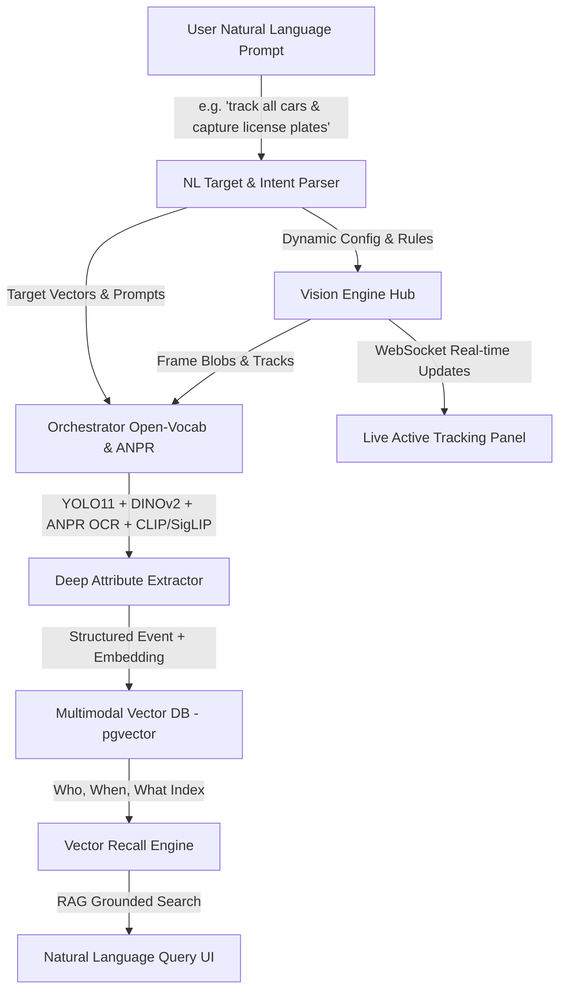

# ADR 0005: Natural Language Dynamic Tracking, Deep Vision Recognition & Vector Dataset AI

## Status
**Partially implemented** (Phase 6). Appearance ReID foundation shipped in
Step 3.5; NL intent, vector dataset, and open-vocab extractors remain.

## Context
The WatchingEye edge-vision platform uses a deterministic Rust core
(`vision-engine`) for frame validation, motion detection, and IoU tracking,
coupled with a Node/LangGraph orchestrator for YOLO detection, DINOv2
appearance embeddings, and VLM scene analysis.

**Shipped (Step 3.5):** hybrid identity (`crates/identity`) blends VLM
attribute matching with DINOv2 cosine similarity, dual-bank appearance
memory, ambiguity gating, Hungarian batch assign, and multi-camera
timelines. Model output still never decides identity alone — Rust arithmetic
does, with provenance on the outcome.

Still required for a full Phase 6 product:
1. Register tracking targets via **natural language** (*"track all dogs"*).
2. Deeper recognition: real ANPR OCR, fine-grained breed/color (SigLIP/CLIP).
3. Indexed **vector dataset** in pgvector with Who/When/What provenance.
4. Natural-language **recall** over that dataset (grounded RAG).
5. Live dynamic tracking control panel driven by NL prompts.

## Architecture & Data Flow



## Detailed Components

### 1. Natural Language Intent & Target Parser (`services/agent-orchestrator/src/nl-parser.ts`)
- Accepts conversational prompts from UI or voice commands.
- Translates input into deterministic system rules:
  ```json
  {
    "target_classes": ["car", "truck", "dog"],
    "attributes": ["license_plate", "breed", "color"],
    "action": "dataset_enroll",
    "trigger_condition": "always_on",
    "confidence_threshold": 0.85
  }
  ```
- Hot-reloads pipeline filters via Fastify gateway WebSocket broadcast without restarting `vision-engine`.
- **Status:** shipped — parser exit criteria + settings/`activeIntent` WebSocket
  broadcast (ROADMAP 6.1 ✅).

### 2. Deep Vision Recognition Stack
- **Detection:** YOLO11n ONNX (shipped, ADR 0004).
- **Appearance ReID:** DINOv2-small ONNX global descriptors → Rust dual-bank memory (shipped, Step 3.5).
- **ANPR:** orchestrator OCR provider path (`plate-ocr.ts`) + regex confirm +
  VLM regex fallback; gateway stays AI-free. Optional backends:
  `WATCHINGEYE_OCR=tesseract` (tesseract.js), `paddle` / `auto` (PaddleOCR
  Python sidecar in `scripts/paddle-lpr.py`, soft-empty without deps).
- **Open-vocab attributes:** CLIP ViT-B/32 ONNX banks + HSV colour fallback
  (ROADMAP 6.2); SigLIP still optional.
- **Identity Registry:** `identity` crate — attrs ⊕ appearance; distinctive refute; Hungarian batch; multi-cam timeline (shipped).

### 3. Vector Database & Dataset Auto-Builder (`apps/gateway/src/vector-db.ts`)
- Stores gated enrollments with DINOv2 appearance embeddings into `pgvector`:
  ```sql
  CREATE TABLE dataset_events (
      id TEXT PRIMARY KEY,
      object_id TEXT NOT NULL,
      camera_id TEXT NOT NULL,
      class TEXT NOT NULL,
      breed_or_model TEXT,
      license_plate TEXT,
      confidence REAL NOT NULL,
      timestamp TIMESTAMPTZ NOT NULL,
      evidence JSONB NOT NULL,
      descriptors JSONB,
      snapshot_ref TEXT NOT NULL,
      embedding vector(384),          -- DINOv2-small appearance
      text_embedding vector(768),     -- nomic / stub text RAG
      clip_embedding vector(512),     -- CLIP ViT-B/32 multimodal
      embed_model TEXT,
      provenance JSONB NOT NULL
  );
  ```
- **Status (partial):** migrate + memory fallback; enroll best-effort
  `/embed`, `/text-embed`, `/clip-embed`. Soft-null when towers missing.

### 4. Natural Language Recall & Grounded RAG Search
- Hybrid keyword ∪ nomic text-NN ∪ CLIP-NN via `GET`/`POST /api/dataset/recall`
  with `verifyGrounded` citations. CLIP text queries use optional
  `scripts/clip-text-embed.py`; image queries use vision ONNX.

### 5. Live Active Tracking Monitor
- Console panel scaffold exists; NL quick-add → engine broadcast remains ROADMAP 6.5.

## Consequences
- Appearance ReID must stay on the slow path (orchestrator), never the motion path.
- Distinctive attribute refute always beats embedding similarity.
- Phase 6 vector DB should reuse the same embedding model version string in provenance.
