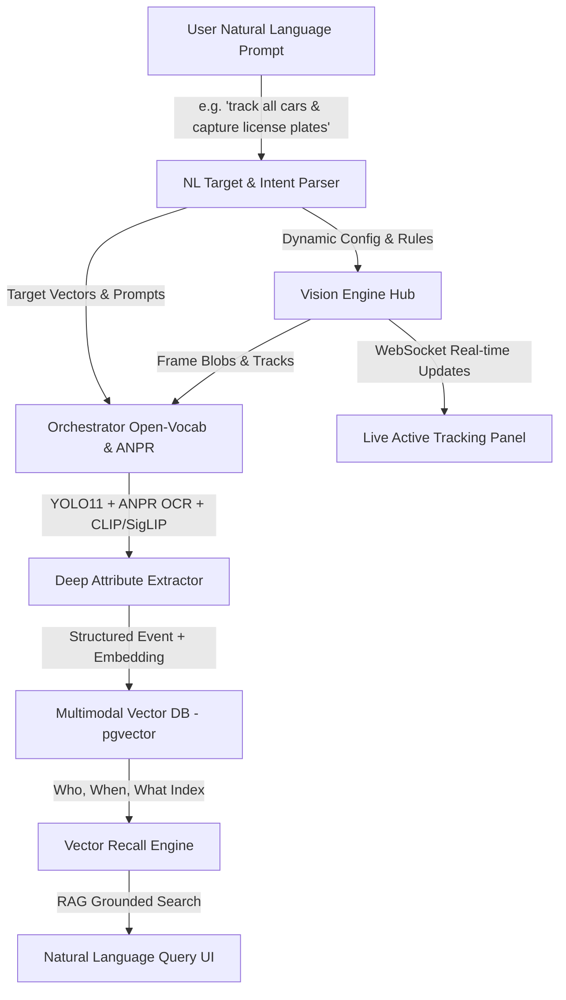

# ADR 0005: Natural Language Dynamic Tracking, Deep Vision Recognition & Vector Dataset AI

## Status
Proposed / Specified in Phase 6

## Context
The WatchingEye edge-vision platform currently uses a deterministic Rust core (`vision-engine`) for frame validation, motion detection, and IoU tracking, coupled with a Node/LangGraph orchestrator for YOLO object detection and VLM scene analysis.

To achieve a **superior image/video recognition and event-collection AI**, users need to:
1. Register and modify tracking targets dynamically using **Natural Language Prompts** (e.g., *"track and register all dogs"*, *"track all cars passing by my house and capture all license plates"*).
2. Perform **Deep Vision Recognition**: License plate OCR (ANPR), dog breed identification, color, speed, trajectory, and biometric identity matching.
3. Automatically build an **Indexed Vector Dataset** in pgvector / Qdrant with full provenance (**Who, When, What**).
4. Perform **Natural Language Recall & Search**: Query historical records conversantly (e.g., *"Show all golden retrievers seen yesterday"*, *"When did license plate ABC-1234 pass by?"*).
5. Inspect live dynamic tracking activity in real-time on the Dashboard.

## Architecture & Data Flow



## Detailed Components

### 1. Natural Language Intent & Target Parser (`services/agent-orchestrator/src/nl-parser.ts`)
- Accepts conversational prompts from UI or voice commands.
- Translates input into deterministic system rules:
  ```json
  {
    "target_classes": ["car", "truck", "dog"],
    "attributes": ["license_plate", "breed", "color"],
    "action": "dataset_enroll",
    "trigger_condition": "always_on",
    "confidence_threshold": 0.85
  }
  ```
- Hot-reloads pipeline filters via Fastify gateway WebSocket broadcast without restarting `vision-engine`.

### 2. Deep Vision Recognition Stack
- **Detection & Segmentation**: YOLO11 for fast detection + SAM2 (Segment Anything 2) for crisp mask cropping.
- **ANPR (Automatic Number Plate Recognition)**: License plate detection + OCR pipeline (Fast-LPR / PaddleOCR).
- **Attribute & Feature Extractor**: SigLIP/CLIP embeddings for fine-grained breed, color, and make/model identification.
- **Identity Registry**: `identity` crate matches visual embeddings to track individuals (e.g. `Dog #3 (Max)` or `Vehicle #12 (License ABC-1234)`).

### 3. Vector Database & Dataset Auto-Builder (`apps/gateway/src/vector-db.ts`)
- Stores every event with 512-dimensional multimodal embeddings into `pgvector`:
  ```sql
  CREATE TABLE dataset_events (
      id UUID PRIMARY KEY,
      object_id UUID NOT NULL,
      camera_id TEXT NOT NULL,
      class TEXT NOT NULL,
      breed_or_model TEXT,
      license_plate TEXT,
      confidence FLOAT NOT NULL,
      timestamp TIMESTAMPTZ NOT NULL,
      bbox JSONB NOT NULL,
      trajectory JSONB,
      snapshot_path TEXT NOT NULL,
      embedding vector(512),
      provenance JSONB NOT NULL
  );
  ```

### 4. Natural Language Recall & Grounded RAG Search (`services/agent-orchestrator/src/rag-search.ts`)
- Converts user queries (*"Show all golden retrievers seen yesterday"*) into hybrid semantic vector search + SQL temporal filtering.
- Returns grounded results with evidence snapshots and timeline markers.

### 5. Live Active Tracking Monitor (`apps/dashboard/components/active-tracking-panel.tsx`)
- Displays currently active tracking directives.
- Features quick-add text prompt input and live enrollment counters.
