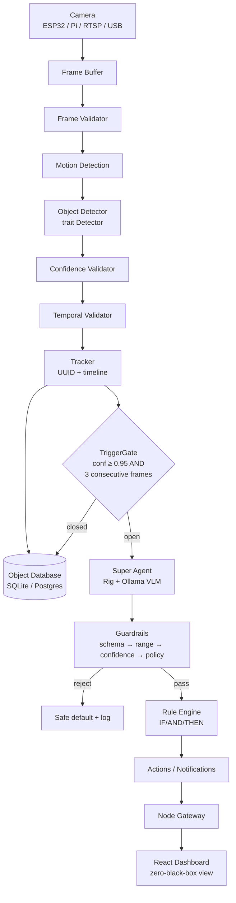

# Architecture Overview



## Crate dependency graph

`schemas` is the root; everything depends on it and nothing depends back:

```
schemas ← events ← rules
schemas ← guardrails
schemas ← camera ← detector
schemas ← tracker
all     ← services/vision-engine
```

## Where things go

- New camera backend → implement `camera::CameraSource` in `crates/camera/src/backends/`
- New vision model → implement `detector::Detector` in `crates/detector/src/backends/`
- New event type → `events::EventKind` variant + rule conditions
- New guardrail gate → add to `guardrails::validate` (order matters; document it)
- MCP servers wrap each crate at the service boundary (Phase 3)
