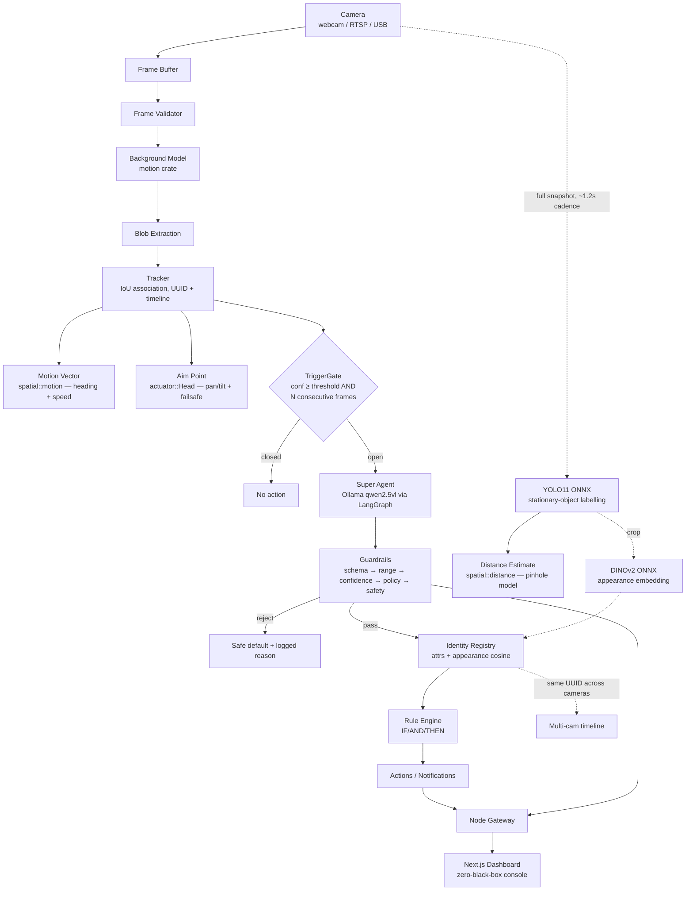
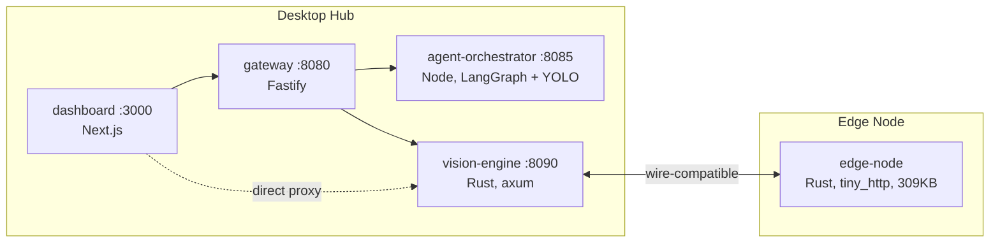

# Architecture Overview

## Pipeline (desktop hub)



Two independent paths run over the same camera feed:
- **Motion path** (Rust, every frame): background subtraction → blobs →
  tracking → heading/aim/gate. Fast, blind to anything not moving.
- **Detection path** (YOLO, ~1.2s cadence): full-frame labelling, so a
  parked car or seated person still gets a name. See ADR 0004 for why this
  runs in the Node orchestrator rather than Rust today. YOLO crops also feed
  DINOv2 appearance embeddings into the identity registry (hybrid attrs +
  cosine), without touching the motion path. Multi-object frames can opt into
  Hungarian batch assignment (`identify: true` on `/detect`) so two similar
  subjects cannot claim the same identity.

The Super Agent (VLM classification) only runs when the motion path's gate
opens — never continuously, never per frame.

## Two applications, one workspace



`edge-node` shares the frame-request/response JSON contract with
`vision-engine`, so a Pi-class device can stand in for the desktop engine
without either the gateway or dashboard changing.

## Crate dependency graph

`schemas` is the dependency root; everything may depend on it, it depends on
nothing internal:

```
schemas ← events ← rules
schemas ← guardrails
schemas ← camera ← detector
schemas ← motion (+ camera)
schemas ← tracker (+ motion for association reuse)
schemas ← identity
camera, motion, tracker, actuator, spatial ← services/vision-engine
camera, motion, tracker, actuator, spatial ← services/edge-node
```

| Crate | Responsibility |
|---|---|
| `schemas` | Shared types: `ObjectClass`, `Detection`, `AgentDecision`, `Provenance` |
| `events` | Typed lifecycle events (`Detected`, `EnteredZone`, ...) |
| `rules` | Declarative IF/AND/THEN rule engine |
| `guardrails` | LLM output validation: schema → range → confidence → policy → safety screen |
| `camera` | `CameraSource` trait — one interface, many backends |
| `motion` | Background-model motion detection + connected-component blob extraction |
| `tracker` | IoU-based association, `TriggerGate`, object timelines |
| `identity` | Deterministic re-identification: weighted attributes + optional appearance cosine (DINOv2); never an LLM |
| `actuator` | Pan/tilt servo control: limits, rate limiting, deadband, failsafe |
| `spatial` | Motion heading/speed + monocular distance estimation |
| `detector` | `Detector` trait (target interface; current YOLO lives in the orchestrator, see ADR 0004) |

## Where things go

- New camera backend → implement `camera::CameraSource`
- New vision model (Rust-side) → implement `detector::Detector`
- New event type → `events::EventKind` variant + rule conditions
- New guardrail gate → add to `guardrails::validate` / `guardrails::safety`
  (order matters; document it) and mirror in
  `services/agent-orchestrator/src/screen.ts`
- New identity attribute → `identity::descriptor::strength_of` classification
- Appearance embed / ReID → orchestrator `embed.ts` + `identity` dual-bank memory
  (never on the motion path); batch assign via `observe_batch`
- New servo axis or animatronic behavior → `crates/actuator`
- MCP servers wrap each subsystem at the service boundary (`packages/mcp-server`)
